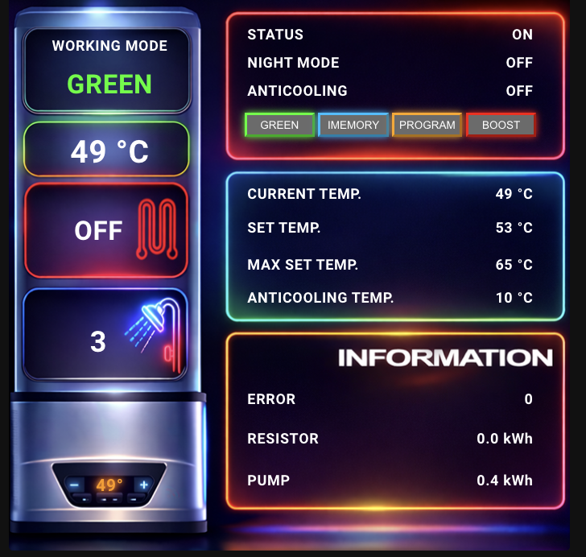

# Ariston Lydos Boiler Card


## ❤️ Support the project
## ❤️ Supporta il progetto

This project is **open-source and free**.
Questo progetto è **open-source e gratuito**.


If you find **Ariston Lydos Boiler Card** useful and want to support its development,
you can make a **voluntary donation**.

Donations are optional and help support development and maintenance.  
Please select **“Goods and Services”** when donating.


Se **Ariston Lydos Boiler Card** ti è utile e vuoi supportarne lo sviluppo,
puoi fare una **donazione volontaria**.

Le donazioni sono facoltative e aiutano a sostenere lo sviluppo e la manutenzione.  
Seleziona **“Beni e servizi”** durante il pagamento.

👉 https://paypal.me/alegen84

---

<p align="center">
  
</p>


## 📖 Description / Descrizione

**Ariston Lydos Boiler Card** is a custom Lovelace card for **Home Assistant**
designed specifically for **Ariston Lydos WiFi water heaters**.

It provides a clean, visual interface to monitor and control:
- Boiler status
- Operation mode (GREEN, IMEMORY, PROGRAM, BOOST)
- Current and target temperature
- Night mode
- Anticooling
- Power, pump and resistor status
- Power, punp and resistor Energy
- No pop-up, click on the status to change it!

---

**Ariston Lydos Boiler Card** è una card personalizzata per **Home Assistant**
pensata specificamente per i boiler **Ariston Lydos WiFi**.

Offre un’interfaccia chiara e intuitiva per monitorare e controllare:
- Stato del boiler
- Modalità operative (GREEN, IMEMORY, PROGRAM, BOOST)
- Temperatura attuale e impostata
- Night mode
- Anticooling
- Stato resistenza e pompa
- Consumo resistenza e pompa
- Nessun pop-up, clicca sul valore per cambiarne lo stato!

---

## 🧩 Features

- Custom Lovelace card
- Designed for Ariston Lydos WiFi
- Clickable controls
- Neon-style mode buttons
- Fully local (Home Assistant)
- Optimized layout
- Compact layout compared to the classic card

---

⚙️ 
Installation
Installazione

### Manual installation
### Installazione manuale

1. Copy the files into: - Copia i file in questa cartella:
```
/config/www/community/boiler-card/
```

2. Add the resource in Home Assistant: - Aggiungi la risorsa in Home Assistant

```
type: module
url: /local/community/boiler-card/boiler-card.js
```

3. Restart Home Assistant - Riavvia Home Assistant


4. Add the card manually to Lovelace - Aggiungi la card manualmente a Lovelance

🛠 Configuration example
```
type: custom:boiler-card
background: /local/community/boiler-card/boiler.png
mode: water_heater.lydos100wifi
showers: sensor.ariston_average_showers
current_temp: sensor.lydos_temperatura_attuale
set_temp: sensor.ariston_proc_req_temp
max_temp: number.ariston_max_setpoint_temperature
anticool: number.ariston_anti_cooling_temperature
error: sensor.ariston_errors_count
resistor: sensor.ariston_domestic_hot_water_resistor_electricity_consumption
pump: sensor.ariston_domestic_hot_water_heating_pump_electricity_consumption
power: switch.ariston_power
anticool_switch: switch.ariston_anti_cooling
boost: switch.ariston_permanent_boost
night: switch.ariston_night_mode
```
NOTE: Change the name of the example sensor to your sensor
NOTE: Cambia il nome del sensore nell'esempio con il tuo sensore di riferimento


⚠️ Disclaimer

This project is not affiliated with Ariston.
Use at your own risk.

Questo progetto non è affiliato ad Ariston.
Usalo a tuo rischio.


❤️ Support the project
❤️ Supporta il progetto

If you enjoy this project and want to support future updates:
Please select **“Goods and Services”** when donating.
Se questo progetto ti è stato utile e vuoi supportarne lo sviluppo:
Seleziona **“Beni e servizi”** durante il pagamento.

👉 https://paypal.me/USER

Your support is appreciated but never required ❤️
Il tuo supporto è apprezzato ma mai obbligatorio ❤️

📜 
Licenza
MIT License
